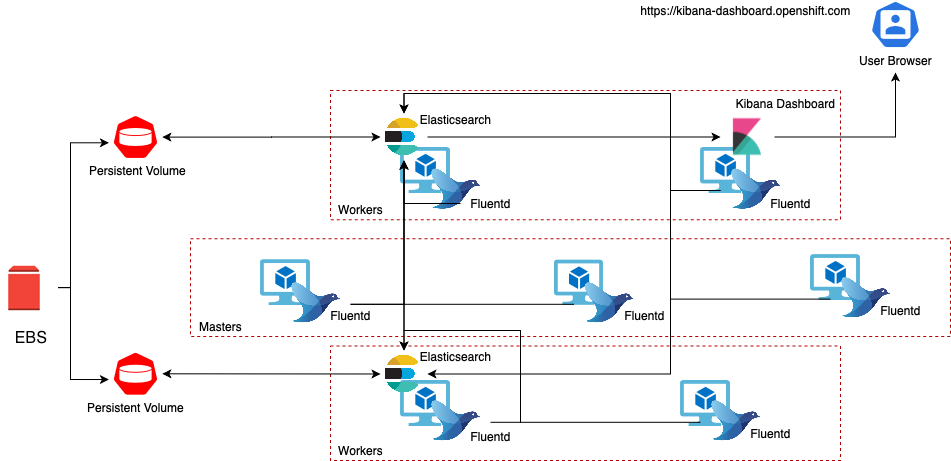

# Ansible Role for Cluster Logging Stack Deployment

## Table of Contents
1. [Role Structure](#paragraph2)
2. [OpenShift Cluster Logging Stack Diagram](#paragraph0)
3. [Cluster Logging Role](#paragraph1)

## Role Structure <a name="paragraph2"></a>

```
├── openshift-logging
│   ├── defaults
│   │   └── main.yml
│   ├── files
│   │   └── main.yml
│   ├── images
│   │   └── logging-diagram.png
│   ├── tasks
│   │   └── main.yml
│   │    └── preconfigure-logging.yaml
│   │    └── deploy-logging.yaml
│   ├── templates
│   │   └── clo-logging-instance.yaml.j2
│   └── vars
│       └── main.yml
```

## OpenShift Cluster Logging Stack Diagram <a name="paragraph0"></a>



From the above diagram, the cluster logging components are based upon Elasticsearch, Fluentd, and Kibana (EFK). 

The collector, Fluentd, is deployed to each node in the OpenShift Container Platform cluster. It collects all node and container logs and writes them to Elasticsearch (ES). 

Kibana is the centralized, web UI where users and administrators can create rich visualizations and dashboards with the aggregated data.

There are currently 5 different types of cluster logging components:

* **logStore** - This is where the logs will be stored. The current implementation is Elasticsearch.
* **collection** - This is the component that collects logs from the node, formats them, and stores them in the `logStore`. The current implementation is Fluentd.
* **visualization** - This is the UI component used to view logs, graphs, charts, and so forth. The current implementation is Kibana.
* **curation** - This is the component that trims logs by age. The current implementation is Curator.
* **event routing** - This component forwards OpenShift Container Platform events to cluster logging. The current implementation is Event Router.


## Cluster Logging Role <a name="paragraph1"></a>

We are installing cluster logging by deploying the Elasticsearch and Cluster Logging Operators. 

* The Elasticsearch Operator creates and manages the Elasticsearch cluster used by cluster logging. 
* The Cluster Logging Operator creates and manages the components of the logging stack.

The following vars are required in the groupvars for the deployment

*Group Vars for Logging deployment*:
```yaml
# Variables required for the logging stack EFK deployment
- name: operator version for Logging stack (must be string)
  logging_operator_version: "4.4"

- name: number of elasticsearch pods to deploy
  es_node_count: 2

- name: storge class for elasticsearch data
  es_storage_class: gp2

- name: Persistent Volume size for Elasticsearch
  es_pv_size: 16G
```

For this speceific role these can currently be found under defaults and will build into the ocp-dev cluster if run locally using the local make under testing local. However these are overridden by host file vars in the metarepo which handles deployments.

Elasticsearch and Cluster Logging Operators are being deployed by creating Subscription object for both:

*Elasticsearch Operator Subscription*:
```yaml
apiVersion: operators.coreos.com/v1alpha1
kind: Subscription
metadata:
  name: elasticsearch-operator
  namespace: openshift-operators
spec:
  channel: "{{ logging_operator_version }}"
  installPlanApproval: Automatic
  name: elasticsearch-operator
  source: redhat-operators
  sourceNamespace: openshift-marketplace
```

*Cluster Logging Operator Subscription*:
```yaml
apiVersion: operators.coreos.com/v1alpha1
kind: Subscription
metadata:
  name: cluster-logging
  namespace: openshift-logging
spec:
  channel: "{{ logging_operator_version }}"
  installPlanApproval: Automatic
  name: cluster-logging
  source: redhat-operators
  sourceNamespace: openshift-marketplace
```

Once both Operators are deployed, we create ClusterLogging instance which will kick off EFK stack components creation:

```yaml
---
apiVersion: "logging.openshift.io/v1"
kind: "ClusterLogging"
metadata:
  name: "instance"                                  #1
  namespace: "openshift-logging"
spec:
  managementState: "Managed"                        #2
  logStore:
    type: "elasticsearch"                           #3
    elasticsearch:
      nodeCount: {{ es_node_count }}                #4
      storage:
        storageClassName: {{ es_storage_class }}    #5
        size: {{ es_pv_size }}
      redundancyPolicy: "SingleRedundancy"
  visualization:
    type: "kibana"                                  #6
    kibana:
      replicas: 1
  curation:
    type: "curator"                                 #7
    curator:
      schedule: "30 3 * * *"
  collection:
    logs:
      type: "fluentd"                               #8
      fluentd: {}
```

1. The name must be `instance`. <br>
2. The cluster logging management state. In some cases, if you change the cluster logging defaults, you must set this to `Unmanaged`. However, an unmanaged deployment does not receive updates until the cluster logging is placed back into a managed state.<br>
3. Settings for configuring Elasticsearch. Using the Custom Resource (ClusterLogging), you can configure shard replication policy and persistent storage.<br>
4. Specify the number of Elasticsearch nodes. See the note that follows this list.<br>
5. Specify that each Elasticsearch node in the cluster is bound to a Persistent Volume Claim.<br>

:exclamation: Persistent Volumes for each Elasticsearch pod must be created beforehand with sufficiant size.<br>

6. Settings for configuring Kibana. Using the Custom Resource (ClusterLogging), you can scale Kibana for redundancy and configure the CPU and memory for your Kibana nodes.<br>
7. Settings for configuring Curator. Using the Custom Resource (ClusterLogging), you can set the Curator schedule.<br>
8. Settings for configuring Fluentd. Using the Custom Resource (ClusterLogging), you can configure Fluentd CPU and Memory limits.<br>

Lets walk through the Role Tasks. 

Here we are creating the Namespace for Cluster Logging. Cluster Logging must be created in `openshift-logging` Namespace. We are also setting the label `openshift.io/cluster-monitoring: "true"`. This will include logging namespace in Cluster Monitoring list.

```yaml
---
# tasks file for logging

- name: Set Namespace for cluster logging
  k8s:
    state: present
    api_version: v1
    kind: Namespace
    definition:
      metadata:
        name: openshift-logging
        annotations:
          openshift.io/node-selector: ""
        labels:
          openshift.io/cluster-monitoring: "true"
```

Here we are deploying Elasticsearch Operator. We are deploying Elasticsearch Operator to `openshift-operators` Namespace which is already present on the cluser.

```yaml
- name: Deploy elasticsearch operator
  k8s:
    state: present
    api_version: operators.coreos.com/v1alpha1
    kind: Subscription
    name: elasticsearch-operator
    namespace: openshift-operators
    definition:
      spec:
        channel: "{{ logging_operator_version }}"
        installPlanApproval: Automatic
        name: elasticsearch-operator
        source: redhat-operators
        sourceNamespace: openshift-marketplace
```

We are creating OperatorGroup for `openshift-logging` namespace. This object will set required RBAC permissions for Operator to run and  create/access required OpenShift resources.

```yaml
- name: Set Operator Group for cluster logging
  k8s:
    state: present
    api_version: operators.coreos.com/v1
    kind: OperatorGroup
    namespace: openshift-logging
    definition:
      metadata:
        name: openshift-logging
      spec:
        targetNamespaces:
        - openshift-logging
```

Here we are deploying Cluster Logging Operator.

```yaml
- name: Deploy cluster logging operator
  k8s:
    state: present
    api_version: operators.coreos.com/v1alpha1
    kind: Subscription
    name: cluster-logging
    namespace: openshift-logging
    definition:
      spec:
        channel: "{{ logging_operator_version }}"
        installPlanApproval: Automatic
        name: cluster-logging
        source: redhat-operators
        sourceNamespace: openshift-marketplace
```

Here we are generating our ClusterLogging custom resource from the template and deploying it on `openshift-logging` Namespace:

```yaml
- name: Make ClusterLogging instance template
  template:
    src: templates/clo-logging-instance.yaml.j2
    dest: "{{role_path }}/files/cluster-logging-kibana-instance.yaml"

- name: Deploy ClusterLogging
  ignore_errors: true
  k8s:
    state: present
    src: "{{role_path }}/files/cluster-logging-kibana-instance.yaml"
```

:exclamation: Containers do not receive ca-bundle from the hosting machines. If you change the CA bundle form Openshift generated to use self provisioned certs you have to add the trust to the logging stack.


This is the list of Pods created by Cluster Logging Stack. As mentioned previously, Fluentd is a DaemonSet running pod on each VM, we have 1 Elasticsearch pod (depending on number requested in the vars file) and 1 Kibana pod:

```bash
$> oc get pods -n openshift-logging

NAME
cluster-logging-operator-cb795f8dc-xkckc

elasticsearch-cdm-b3nqzchd-1-5c6797-67kfz


fluentd-2c7dg
fluentd-9z7kk
fluentd-br7r2
fluentd-fn2sb
fluentd-pb2f8
fluentd-zqgqx
fluentd-rf4er

kibana-7fb4fd4cc9-bvt4p
```

# 3 Musketeers pattern
Make, Docker and Docker compose elements:    

https://3musketeers.io/

# Testing

## Linting

### Locally
Dependencies for local linting without Docker:
```
Python3: latest
PyPI: latest
Ansible: latest
Molecule: latest
Ansible Lint: latest
YAML Lint: latest
```
TODO: python env install with pinned versions steps for local linting without Docker.
```
# ansible-lint
ansible-lint Ansible_Master_Playbook.yaml

#yamllint
yamllint Ansible_Master_Playbook.yaml
```

### GitHub Actions
`.github/workflows/ansible-linting.yaml`

## Dry Run
```
# Locally
cd to /tests/local

make ansible-logging-deploy
```